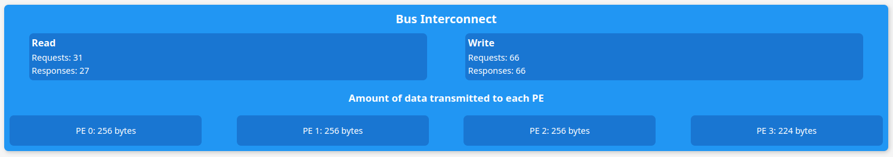

# Project 2 CE4302 

## Prerequisites

+ `Make` build tool 
+ C++ compiler `g++`, avaialble in the `PATH` 
+ `libwebsockets` library installed with include path either at system level or at `/opt/homebrew/include` (MacOS)
+ `npm` (Required to build react applications) 

## Build Steps

### Simulator

A makefile is provided to automate the build process:

```Shell
cd simulator 
make
cd ..
```

Will be enough to obtain the compiled executable  `simulador/build/simul`

### GUI

Before being able to run the application, the npm dependencies must be installed.

```Shell
cd GUI
npm install
```

Should be enough to pull all dependencies.

## Usage

### Run Simulation Server

The server needs to be executed before the GUI is launched. To do this, just open a terminal and run the executable built previously that can be found at 

```Shell
simulador/build/simul
```

### Start GUI application 

Open a terminal of your choice and execute:

```Shell 
npm run dev
```

The following message should be shown:


Open you web browser and enter the local address, or `ctrl+click` over the link and that should open the GUI 

Interaction with the simulation happens via the control console:


Function of the buttons of the control menu work as follows:

- `Play`: If the simulation has not been launched, launches the simulation. If there's already a simulation running but it's paused, it returns to normal execution. 
- `Step`: Only works when the simulation is paused. Executes a single simulation step 
- `Pause`: Pauses execution and enables stepping capabilities
- `Stop`: Aborts execution of current simulation

The textboxes are for providing the paths to files that initialize instruction memory and data memory. All file paths must be submitted before clicking `Play`

The "Events" box will show bus events as they are being processed in the simulation. 

#### Bus statistics 

Some data can be seen in runtime in the bus component:



Some other stats are only shown upon workload execution completion after the memory array display:


## Assembly format 

The ISA is composed of 4 required functions and an extra one

```asm
LOAD REG[n] [addr]
STORE REG[n] [addr]
INC REG[n]
DEC REG[n]
MUL REG[n] REG[n]
```

The `[addr]` field is taken as an address specification which might be either a constant inmediate or a register for indirect addressing. 


Example extract:

```asm
LOAD REG1 2
LOAD REG2 3
LOAD REG0 1
STORE REG0 12
vres_calc:
LOAD REG0 0
LOAD REG3 3
loop_vres_addr:
    INC REG3
    DEC REG0
    JNZ [loop_vres_addr]
    STORE REG3 13
```

## Memory init file format

The memory init file is just a text file containing one integer value per line. Each line will correspond to a memory cell. Sample values:

```
0x10
0x4
0x1c
0x2c
0x0
0x1
0x2
0x3
0
0
0
0
...
```

## Sample workloads

Sample asembly files implementing different workloads are provided in the `workloads/ensamblador/` folder such as 
`contador_1s` and `suma_vectores`. These folders provide the assembly files for each pe and the main memory init .txt file. 